# Rocky Linux Build System（koji）


---

* 地址: <https://koji.rockylinux.org/koji/>


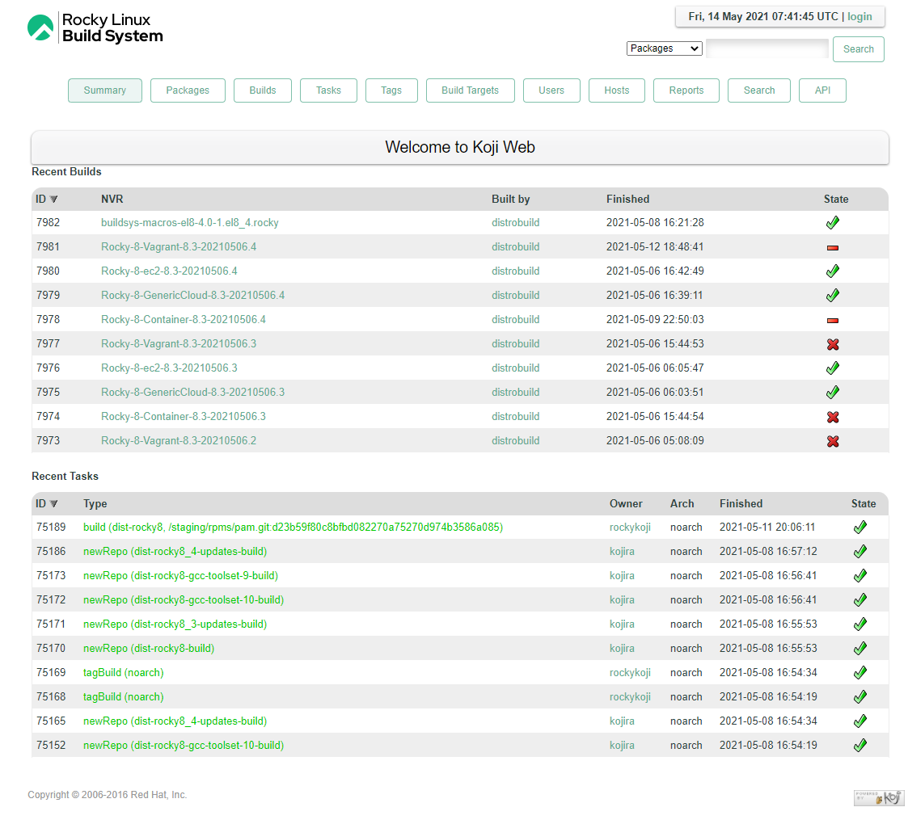

## 用户

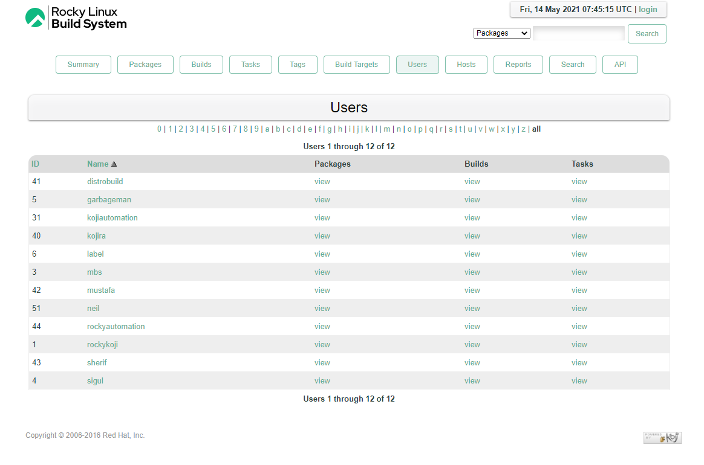

当前只有12个小盆友在用这个构建平台，当然包括管理员

## 构建主机

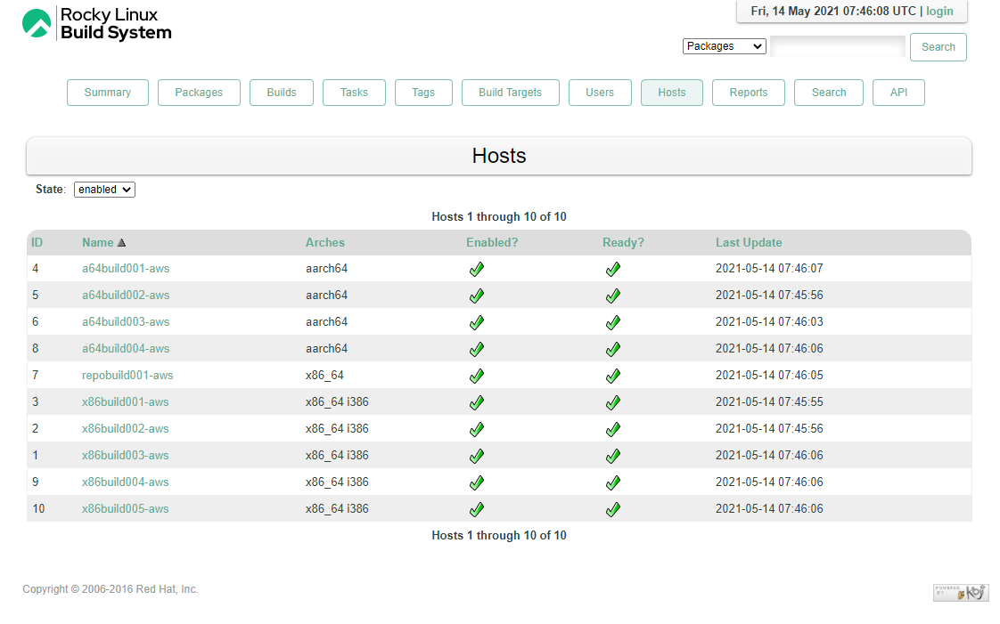

* 主机少的可怜，目前也就预先支持x86_64、i386和aarch64
* 用的aws

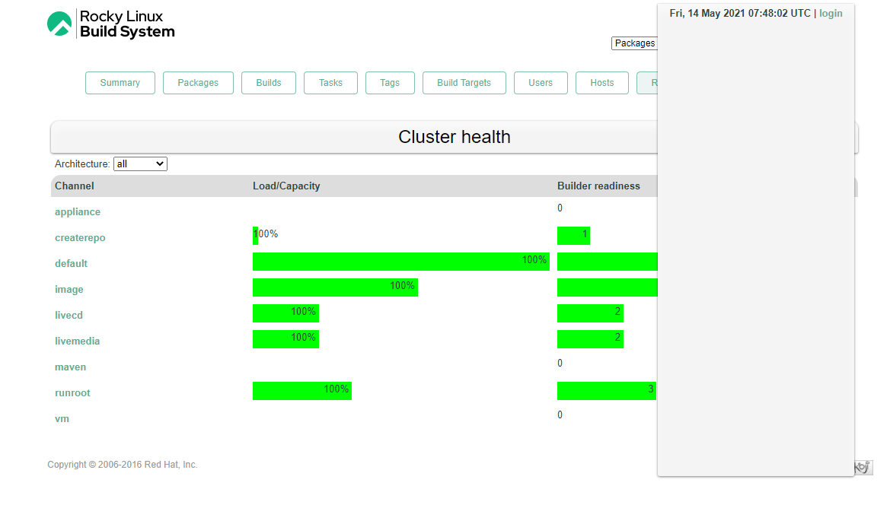

一不小心发现了个界面bug，右侧是不是过分长了。。

## 界面主题

* <https://github.com/rocky-linux/koji-rocky-theme>
* 在koji默认主题上魔改一个主题
* 换了个header.html，几张照骗，改了个样式

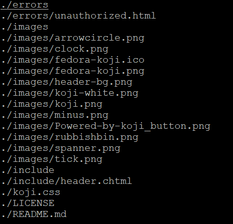

* koji是个好东西，不少厂在玩。<https://pagure.io/koji/>
* fedora基础设施构建还是值得好评，虽然比较激进，但是至少，它是实打实的在往长远发展

## 注册账户

* koji一贯风格，没有注册，只有登录

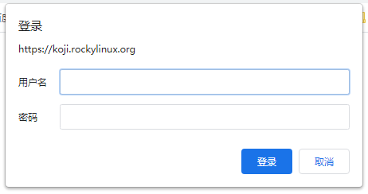

* 不过，当前好像没有任务，机器闲置，浪费。。。

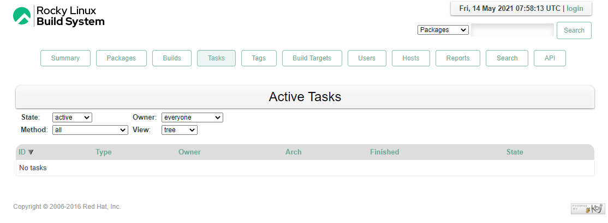

```
Money can't buy you love—but it can sponsor a new Linux distro.
```

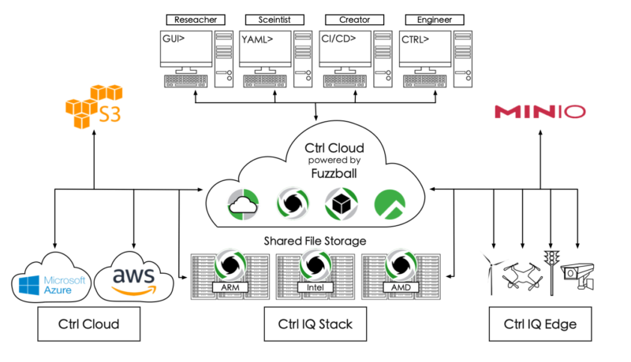


* <https://accounts.rockylinux.org/>

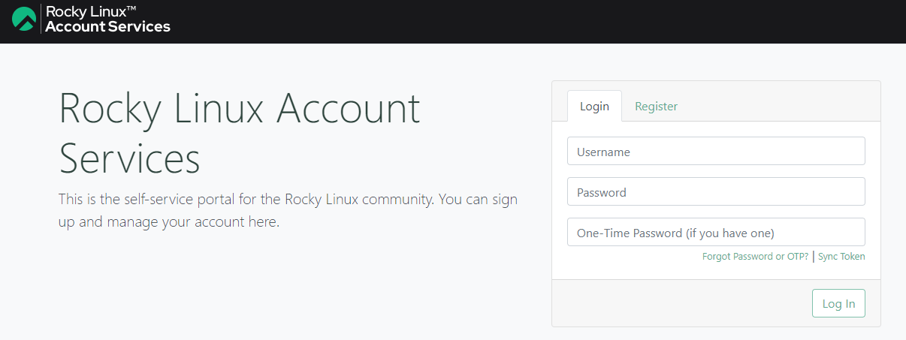

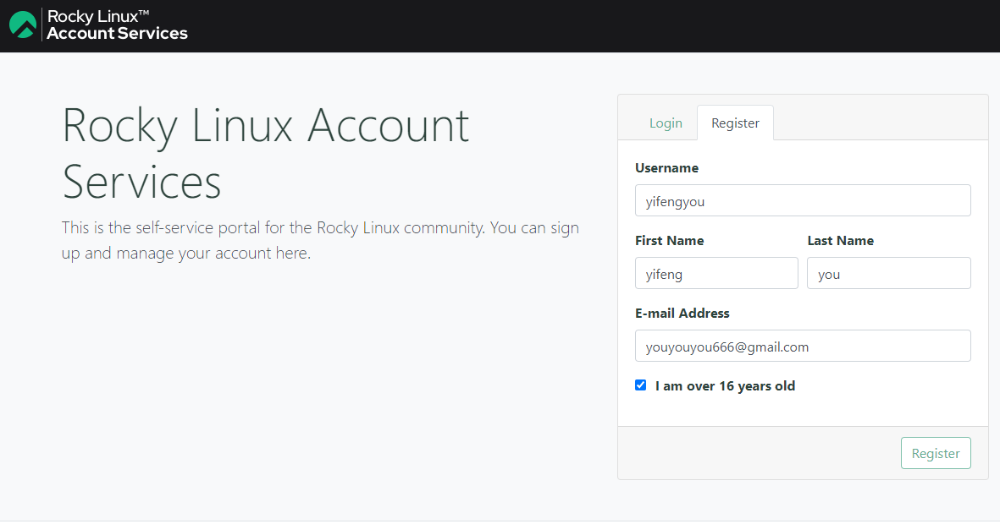

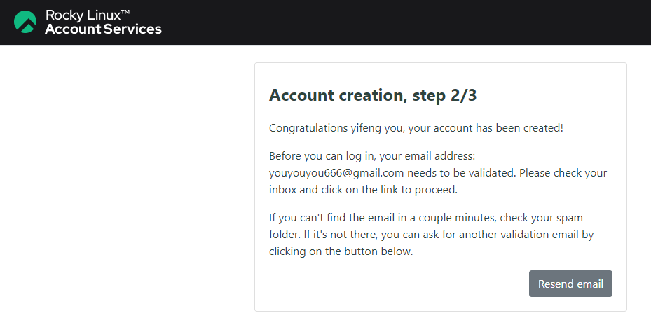


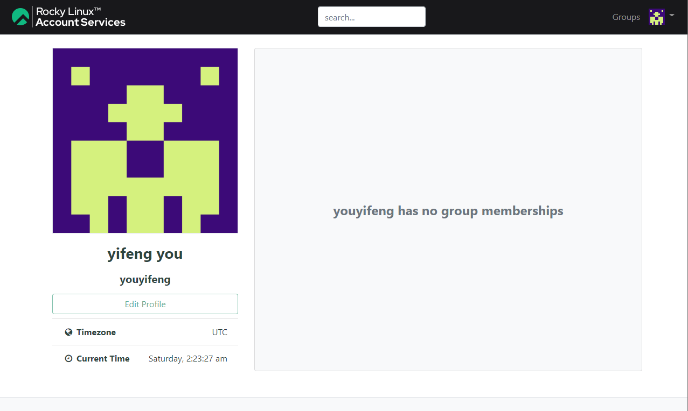

* 这里的个人头像使用的是libravatar，登录注册一通搞，之后就是。。
* 这个libravatar玩法是酱紫滴，其实是个跨站访问，打开页面会请求libravatar，传递当前用户基本信息，然后显示。因此只要libravatar配置好，上传图片，各种邮箱验证都ok，自然就会显示

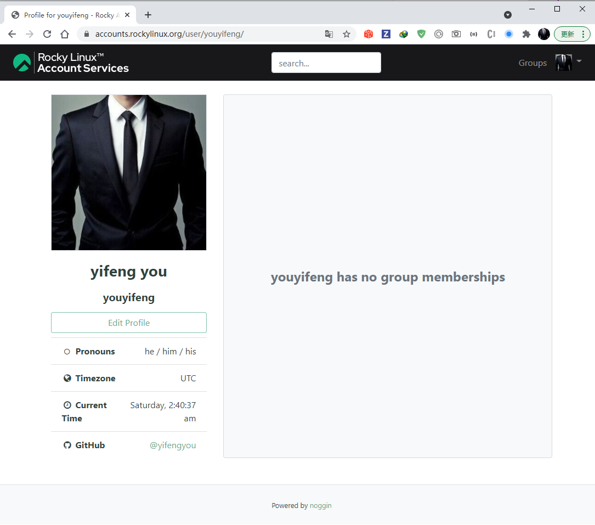

## 兴趣组Group

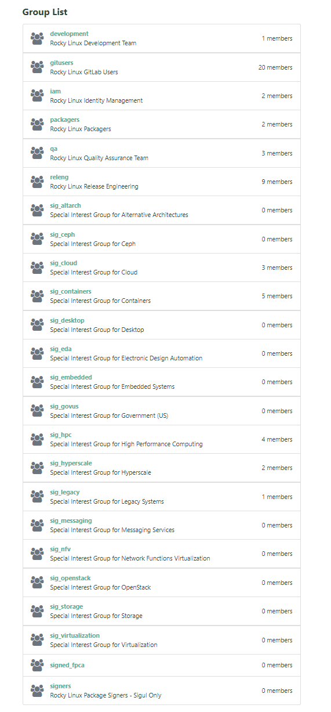

* 想加入，请联系大佬拉你
* 除了发邮件，还有啥？


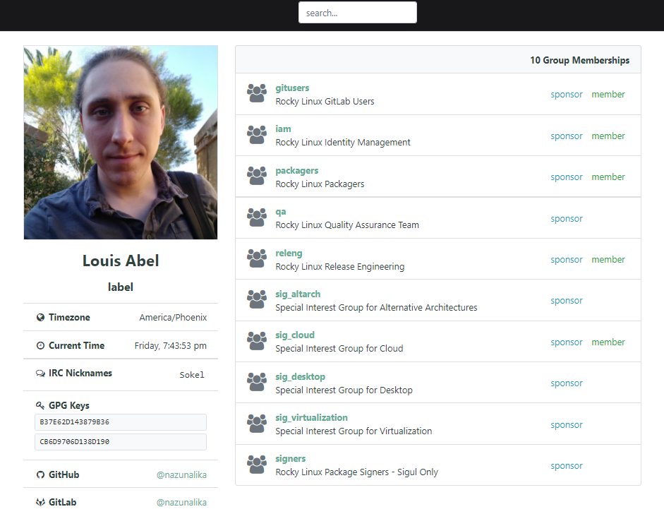

## Bug Report

* <https://bugs.rockylinux.org/>

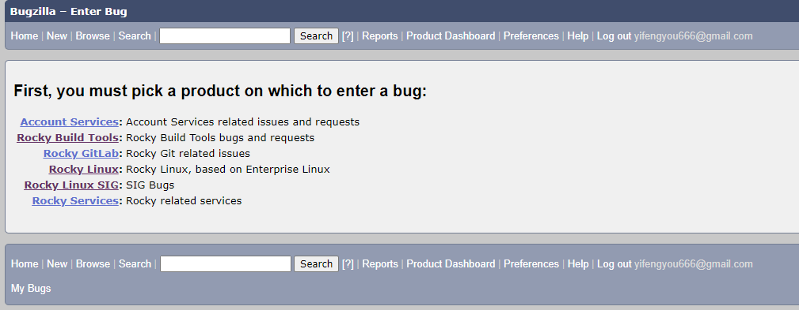

## 论坛


* <https://forums.rockylinux.org/>
* 目前活跃度并不高


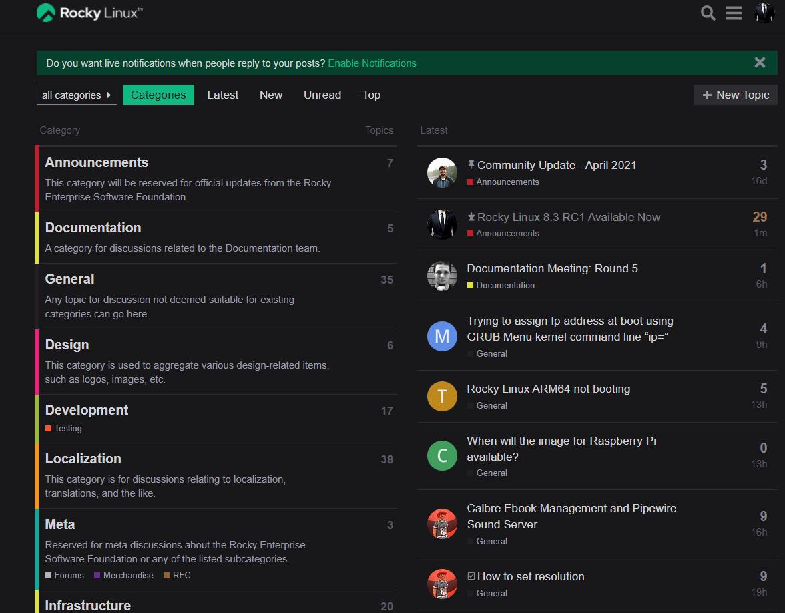


## 相关邮件地址


| Team           | Contact                       |
| -------------- | ----------------------------- |
| Community      | community@rockylinux.org      |
| Design         | design@rockylinux.org         |
| Development    | development@rockylinux.org    |
| Documentation  | documentation@rockylinux.org  |
| Security       | security@rockylinux.org       |
| Infrastructure | infrastructure@rockylinux.org |
| Web            | web@rockylinux.org            |

For all other questions: hello@rockylinux.org


---
